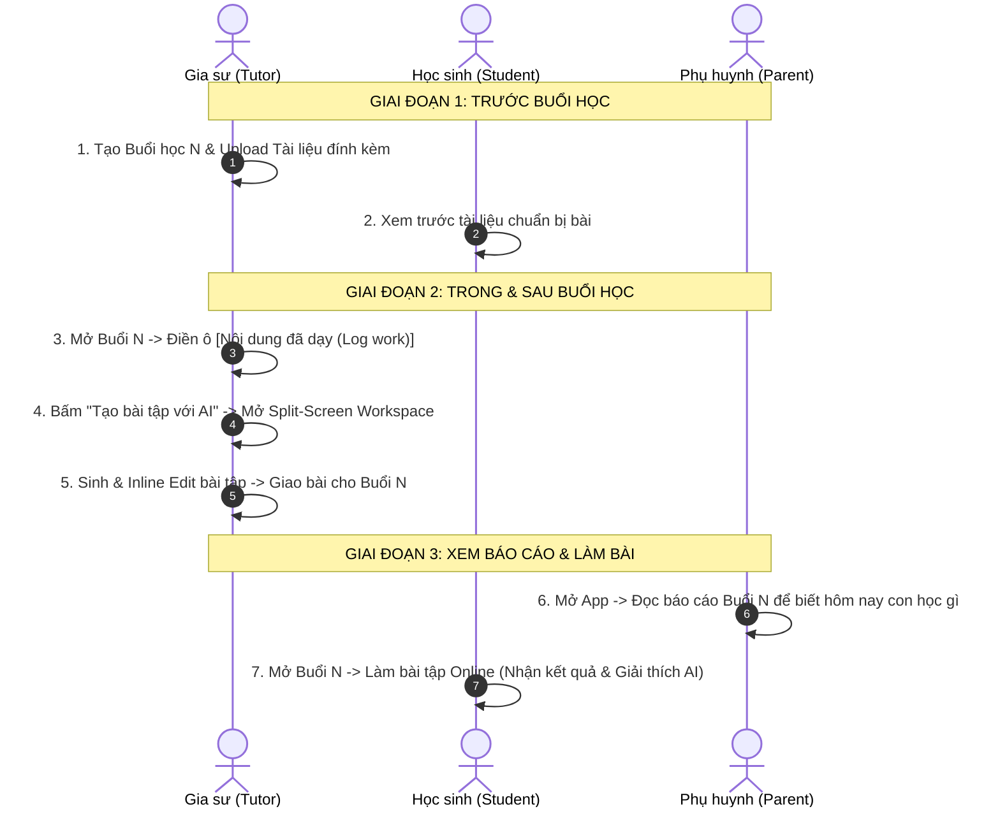

# Tóm tắt Định hướng Thiết kế: Tính năng Buổi Học Thực Tế & Nhật Ký Dạy Học (Daily Lesson Session & Log Work)

## 1. Tầm nhìn & Tách biệt Kiến trúc (Architectural Separation)

- **Tách biệt Macro (Lộ trình) & Micro (Thực thi):**
  - **Khung chương trình (Curriculum Roadmap)**: Đóng vai trò là Kế hoạch tổng quan (Master Plan) tĩnh mang tính định hướng dài hạn.
  - **Buổi học thực tế (Daily Lesson Sessions)**: Là Dòng thời gian thực tế (Dynamic Timeline) của từng ngày dạy.
- **Tính Độc lập Hoàn toàn**: Buổi học thực tế không tự động ràng buộc hay binding cứng với các bài học trong Roadmap. Điều này đảm bảo tính linh hoạt tối đa khi dạy nhanh/chậm tiến độ so với kế hoạch ban đầu.

---

## 2. Cấu trúc Buổi Học Thực Tế (Session Structure)

Mỗi buổi học thực tế bao gồm các thành phần tối giản, tập trung vào **Tính Minh Bạch (Transparency)** cho cả 3 bên: Gia sư, Học sinh, Phụ huynh:

1. **Thông tin chung**: Tiêu đề buổi học (VD: *Buổi 5 - Grammar & Listening*), Số thứ tự buổi và Ngày giờ học.
2. **Tài liệu & Bài tập đính kèm (Session Attachments)**: Upload file PDF/Word/Slides hoặc đường dẫn liên kết dùng cho buổi học đó.
3. **Báo cáo Nội dung Buổi học (Public Class Log Work)**: 
   - 1 ô văn bản tự do (Text/Markdown Area) duy nhất cho gia sư viết báo cáo ngắn gọn hôm nay đã dạy gì và dặn dò bài tập.
   - **Quyền xem**: Gia sư, Học sinh và Phụ huynh đều xem được chung 1 nội dung này.
4. **Tối giản tối đa (No Fluff)**:
   - Loại bỏ các ghi chú riêng/nhận xét cá nhân rắc rối.
   - Loại bỏ nút bấm thả icon hay nút xác nhận "Đã xem" từ phụ huynh để tránh ma sát (frictionless).

---

## 3. Tích hợp AI Sinh Bài Tập (AI Exercise Generator Migration)

Chuyển giao toàn bộ bộ công cụ **AI Sinh bài tập kiểu Coursera (Split-Screen Workspace)** từ Chi tiết Bài học trong Roadmap sang **gắn trực tiếp tại Chi tiết Buổi học (Session Detail)**.

```
[Danh sách Buổi học] ➔ [Chi tiết Buổi học N] ➔ [Bấm "Tạo bài tập với AI"] ➔ [Mở Split-Screen Workspace]
```

### Bố cục Màn hình Workspace (Split-Screen):
- **Cột TRÁI (Main Canvas - 65% màn hình)**:
  - Hiển thị danh sách câu hỏi dạng thẻ trực quan.
  - Cho phép **Sửa tay trực tiếp (Inline Editing)** trên văn bản (câu hỏi, phương án A/B/C/D, Lời giải thích AI).
  - Tự động cập nhật trực quan (**Live Update**) khi AI sinh hoặc tinh chỉnh.
- **Cột PHẢI (Right Assistance Dock - 35% màn hình)** với **2 Tabs**:
  - **TAB 1: Form / Content (Cấu hình & Tạo ban đầu)**:
    - **Auto-load Context của Buổi N**: Tự động tải **Tài liệu đính kèm** & **Nội dung đã dạy (Log Work)** của Buổi N hôm đó (có nút `(X)` để gia sư gỡ bỏ nếu không muốn làm context).
    - Cấu hình số lượng câu, dạng bài, độ khó.
    - Nút `⚡ Sinh bài tập với AI` + Tùy chọn `Import File (0 Token Cost)`.
  - **TAB 2: Chat Freestyle (AI Co-pilot Tinh chỉnh)**:
    - Khung chat ngôn ngữ tự nhiên với AI Co-pilot.
    - Gia sư chat yêu cầu AI chỉnh sửa câu hỏi, đổi dạng câu, tăng/giảm độ khó...
    - AI phản hồi trong chat và tự động cập nhật trực tiếp (**Live Update**) lên Main Canvas bên trái.

### Sinh Metadata & Cập nhật SKP (Zero LLM Overhead on Submission):
- **AI sinh sẵn khi tạo bài tập**: Đáp án đúng, Lời giải thích AI chi tiết, `difficulty` (1-100), `micro_skill_tags`.
- **Học sinh nộp bài**: Backend lấy trực tiếp metadata lưu sẵn trong CSDL để tính công thức **Elo Rating** và tự động đẩy vào lịch **Spaced Repetition (SM-2)** mà **không gọi LLM** khi nộp bài.

---

## 4. Hành trình Người Dùng (User Journey)

### Mermaid Flow Chart:


### Chi tiết các bước:
1. **Gia sư**:
   - Trước hoặc sau giờ dạy, mở Buổi N.
   - Gõ 1-2 câu báo cáo nội dung đã dạy vào ô Log work.
   - Bấm "Tạo bài tập với AI" để sinh bài tập cá nhân hóa bám sát nội dung vừa dạy + SKP của học sinh.
   - Duyệt bài và bấm Giao.
2. **Phụ huynh**:
   - Vào danh sách Buổi học của con -> Click Buổi N.
   - Đọc báo cáo nội dung bài học + xem danh sách tài liệu/bài tập đã giao để nắm tiến độ thực tế minh bạch.
3. **Học sinh**:
   - Vào Buổi N -> Xem tài liệu học -> Làm bài tập trực tuyến -> Nhận kết quả, đọc lời giải thích AI và ôn tập ngắt quãng (Spaced Repetition).
