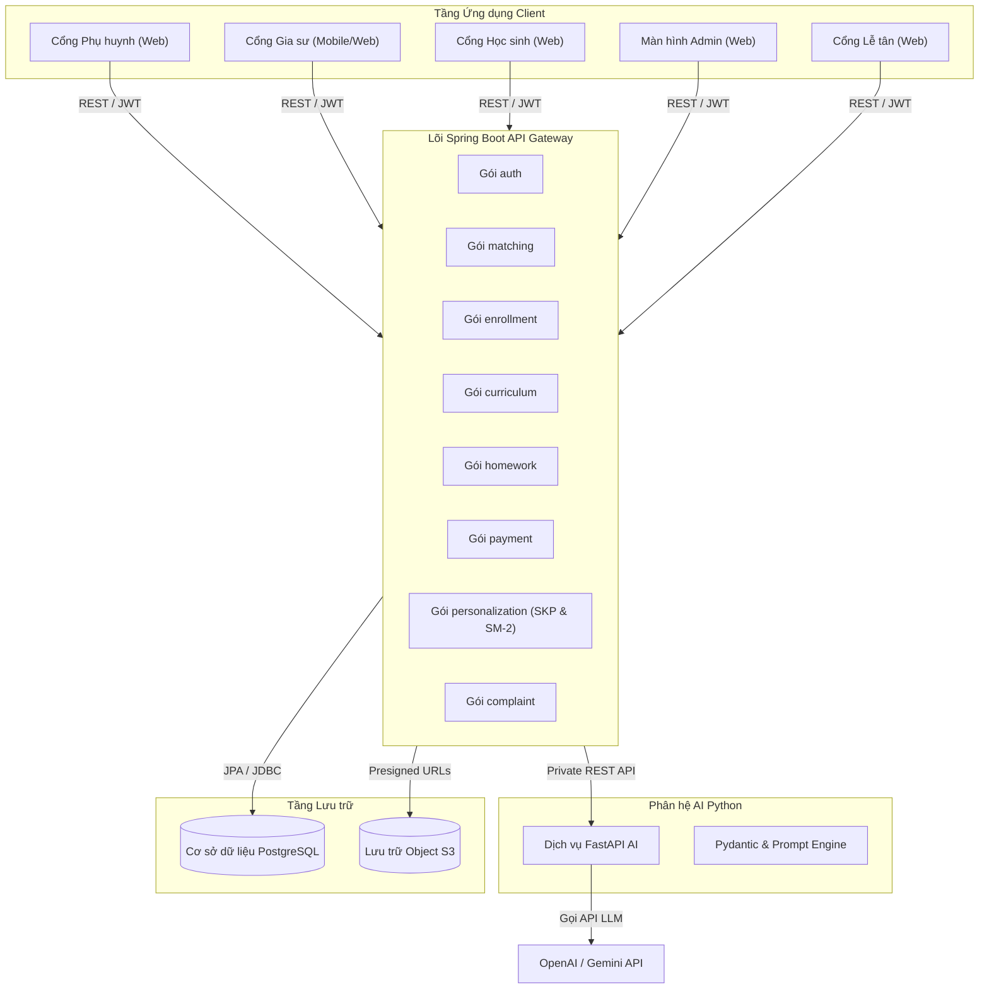
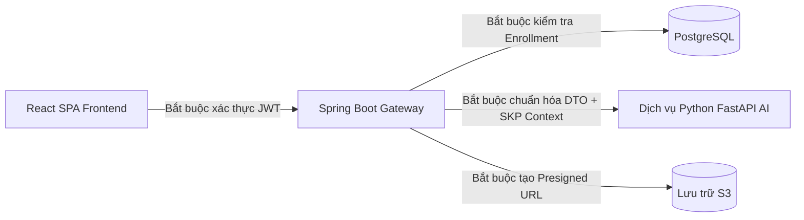
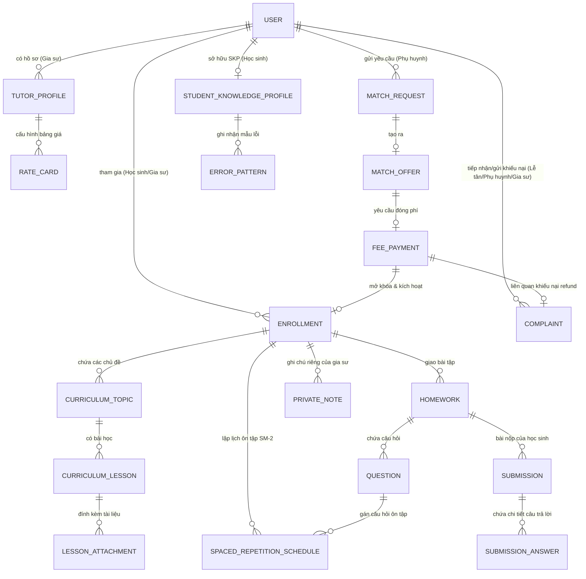

# Xương sống Kiến trúc — Nền tảng hỗ trợ vận hành và giảng dạy cá nhân hóa cho mô hình gia sư tiếng Anh ứng dụng LLM và Spaced Repetition

## Mô hình Thiết kế (Design Paradigm)

Hệ thống áp dụng mô hình kiến trúc **Modular Monolith** cho các nghiệp vụ cốt lõi, kết hợp cùng một **Dịch vụ AI Subsystem (Python FastAPI)** chuyên trách cho các tác vụ sinh nội dung thông minh và trích xuất dữ liệu bài tập/lộ trình dựa trên Hồ sơ tri thức người học (SKP).

- **Giao diện (Frontend)**: Ứng dụng React 19 Single Page Application (SPA) phục vụ 5 cổng thông tin người dùng (Phụ huynh, Gia sư, Học sinh, Quản trị viên - Admin, Lễ tân - Receptionist) với cơ chế bảo mật tuyến đường (Route Guard) dựa trên vai trò.
- **Lõi Backend**: Ứng dụng Java Spring Boot 3.4.x cấu trúc theo 8 gói nghiệp vụ (domain packages) rõ ràng (`auth`, `matching`, `enrollment`, `curriculum`, `homework`, `payment`, `personalization`, `complaint`). Spring Boot đóng vai trò là API Gateway duy nhất cho các ứng dụng client và thực thi các giao dịch bất biến (Transactional Invariants).
- **Phân hệ AI (AI Subsystem)**: Dịch vụ Python 3.12 FastAPI xử lý tích hợp LLM (OpenAI `gpt-4o-mini` / Google Gemini Flash), quản lý Prompt Engineering và trích xuất cấu trúc dữ liệu JSON cho tính năng Dual-Mode (Khung chương trình & Bài tập cá nhân hóa nhúng SKP Context).
- **Tầng Dữ liệu**: Cơ sở dữ liệu quan hệ PostgreSQL 16 quản lý dữ liệu nghiệp vụ (bao gồm SKP, Elo Rating và Spaced Repetition Schedule), kết hợp cùng MinIO / S3-compatible Object Storage lưu trữ tài liệu truyền thông (video bài giảng, tài liệu học tập, ảnh biên lai nộp phí QR proof).



---

## Các Quy tắc & Quyết định Bất biến (Invariants & Rules)



### AD-1 — Mô hình Kiến trúc Modular Monolith cho Backend

- **Ràng buộc:** `all` (Tất cả gói nghiệp vụ Backend)
- **Ngăn chặn:** Tình trạng over-engineering phân rã microservices cồng kềnh, độ trễ mạng phát sinh và rủi ro bất đồng bộ giao dịch giữa phê duyệt phí & mở khóa thông tin liên hệ.
- **Quy tắc:** Backend chính phải là một ứng dụng Java Spring Boot duy nhất được tổ chức thành 8 gói nghiệp vụ phân tách rõ ràng (`com.englishtutor.backend.domain.*`: `auth`, `matching`, `enrollment`, `curriculum`, `homework`, `payment`, `personalization`, `complaint`). Tương tác giữa các domain trong Spring Boot phải thực hiện thông qua Spring Service Interface bên trong ranh giới giao dịch `@Transactional`. Nghiêm cấm việc gọi trực tiếp Repository qua ranh giới gói khác.

### AD-2 — Dịch vụ AI Python FastAPI Chuyên trách

- **Ràng buộc:** `FR-8`, `FR-30`, `Vận hành Dual-Mode AI`
- **Ngăn chặn:** Việc làm cồng kềnh mã nguồn Java Backend bởi các thư viện prompt engineering/SDK LLM phức tạp; giúp linh hoạt nâng cấp prompt và hỗ trợ parse file 0-token cost.
- **Quy tắc:** Java Spring Boot đóng vai trò API Gateway duy nhất tiếp nhận request từ client. Spring Boot ủy quyền các tác vụ AI (Option A sinh trực tiếp & Option B trích xuất file cấu trúc JSON) sang dịch vụ Python FastAPI nội bộ qua REST API riêng tư trong VPC (`http://ai-service:8000/api/v1/ai/*`). Dịch vụ Python trực tiếp gọi LLM (`gpt-4o-mini` / `Gemini Flash`) và xác thực cấu trúc dữ liệu qua Pydantic.

### AD-3 — Phân quyền RBAC theo Enrollment & Bảo vệ Ghi chú Riêng tư

- **Ràng buộc:** `FR-19`, `FR-25`, `Các Endpoint Dữ liệu Học sinh`
- **Ngăn chặn:** Gia sư chưa kết nối truy cập trái phép dữ liệu học sinh; rò rỉ Ghi chú riêng tư (Private Notes) sang cổng Học sinh hoặc Phụ huynh.
- **Quy tắc:** Sử dụng Spring Security JWT kết hợp Custom Annotation `@PreAuthorize("@enrollmentGuard.canAccessStudent(authentication, #studentId)")` để bảo vệ mọi API học sinh. Gia sư chỉ được xem dữ liệu của học sinh có liên kết `Enrollment` ở trạng thái `ACTIVE`. Trường ghi chú riêng tư (`private_notes`) phải bị loại bỏ (strip) khỏi tất cả DTO trả về cho Học sinh và Phụ huynh tại tầng Serializer Controller.

### AD-4 — Chuẩn hóa Cấu trúc Dữ liệu Dual-Mode (Option A & Option B)

- **Ràng buộc:** `FR-8`, `FR-30`
- **Ngăn chặn:** Sự sai lệch cấu trúc dữ liệu giữa bài tập/chương trình do AI sinh ra và file JSON/Text do người dùng upload từ ChatGPT/Claude bên ngoài.
- **Quy tắc:** Cả Option A (Sinh trực tiếp) và Option B (Import File) đều phải tuân thủ chuẩn JSON Schema v1.0 chung (`CurriculumDraftSchema` và `HomeworkDraftSchema`). Mọi file upload Option B phải gửi tới endpoint `/api/v1/ai/parse-file` trên Dịch vụ Python AI để kiểm duyệt và chuyển đổi trước khi lưu vào PostgreSQL.

### AD-5 — Quy trình Duyệt Biên lai Phí & Ẩn/Hiện Thông tin Liên hệ

- **Ràng buộc:** `FR-16`, `FR-23`, `FR-34`
- **Ngăn chặn:** Việc rò rỉ thông tin liên hệ (SĐT, Địa chỉ) của Phụ huynh cho Gia sư trước khi Admin hoặc Lễ tân xác nhận biên lai nộp phí.
- **Quy tắc:** Thông tin liên hệ trong kết quả trả về cho Gia sư luôn ở trạng thái ẩn (`masked: true`) cho đến khi `FeePayment.status == 'PAID'`. Việc chuyển trạng thái sang `PAID` chỉ được kích hoạt duy nhất bởi hành động bấm duyệt của Admin/Lễ tân trong một database transaction, đồng thời tự động ghi nhận nhật ký hệ thống Audit Log (`FR-20`).

### AD-6 — Chiến lược Lưu trữ File Truyền thông qua S3 Presigned URL

- **Ràng buộc:** `FR-21`, `FR-23`
- **Ngăn chặn:** Việc lưu tệp tin dung lượng lớn directly vào DB PostgreSQL hoặc công khai URL bucket S3 không an toàn.
- **Quy tắc:** Video bài giảng, tài liệu học tập (PDF/Word) và ảnh biên lai chuyển khoản QR proof phải được lưu trữ tại Object Storage tương thích S3 (MinIO ở môi trường dev, AWS S3 / Cloudflare R2 trên prod). Client tải lên và tải xuống tệp tin trực tiếp qua Presigned URLs do Spring Boot khởi tạo với thời gian hết hạn ngắn (15 phút).

### AD-7 — Cấu trúc React SPA với Bảo mật Tuyến đường dựa trên Vai trò

- **Ràng buộc:** `Cổng Phụ huynh`, `Cổng Gia sư`, `Cổng Học sinh`, `Màn hình Admin`, `Cổng Lễ tân`
- **Ngăn chặn:** Truy cập trái phép vào các màn hình chức năng và rò rỉ state giữa 5 vai trò người dùng (`ROLE_PARENT`, `ROLE_TUTOR`, `ROLE_STUDENT`, `ROLE_ADMIN`, `ROLE_RECEPTIONIST`).
- **Quy tắc:** Frontend là một ứng dụng React 19 SPA duy nhất xây dựng bằng Vite và React Router DOM v7. Phân quyền tuyến đường sử dụng thành phần `<ProtectedRoute allowedRoles={['ROLE_TUTOR']}>` để kiểm tra quyền hạn trong JWT Token. State dữ liệu server được quản lý thống nhất qua TanStack Query để đảm bảo tính nhất quán dữ liệu và tự động làm mới cache.

### AD-8 — Quản lý State SKP & Thuật toán Elo Rating tại Backend Java

- **Ràng buộc:** `FR-38`, `FR-8`
- **Ngăn chặn:** Race condition khi gọi nhiều lượt sinh bài AI song song; lộ thông tin định danh học sinh cho LLM bên thứ 3; hoặc tính toán lại năng lực sai lệch giữa các bài tập. `[ASSUMPTION]`
- **Quy tắc:** Mọi biến động điểm Elo rating ($\text{Expected}$, $\text{mastery}_{\text{new}}$) và lưu vết trạng thái `Student Knowledge Profile (SKP)` được quản lý tập trung và thực thi duy nhất bên trong DB transaction của Java Spring Boot (`com.englishtutor.backend.domain.personalization`). Phân hệ AI Python (`ai-service`) đóng vai trò hoàn toàn **stateless**, tiếp nhận vỏ bọc dữ liệu `SKPContextDTO` (chứa micro-skill, Elo rating, Top 5 lỗi hay mắc dạng ẩn danh) từ Spring Boot để làm **Adaptive Input Context** khi gọi LLM sinh bài tập cá nhân hóa.

### AD-9 — Thuật toán Ôn tập Ngắt quãng Spaced Repetition (SM-2) & Lập lịch Hàng ngày

- **Ràng buộc:** `FR-39`
- **Ngăn chặn:** Độ trễ query tính toán lớn (CPU heavy) mỗi khi học sinh đăng nhập; trễ lịch gợi ý câu hỏi ôn tập theo đường cong quên lãng Ebbinghaus. `[ASSUMPTION]`
- **Quy tắc:** Thuật toán SM-2 cập nhật các thông số `next_review`, `interval`, và `ease_factor` đồng bộ ngay tại thời điểm học sinh nộp câu trả lời. Tầng Backend lưu trữ trạng thái ôn tập vào bảng `spaced_repetition_schedules` và duy trì Composite Index `(student_id, next_review)` để trả về danh sách câu hỏi cần ôn tập hàng ngày trên Cổng Học sinh với độ trễ < 100ms.

### AD-10 — Quy trình Xử lý Khiếu nại (REFUND / REMATCH) & Phân quyền Lễ tân

- **Ràng buộc:** `FR-31`, `FR-32`, `FR-33`, `FR-34`, `FR-37`
- **Ngăn chặn:** Lễ tân tự ý duyệt hoàn tiền làm thất thoát ngân sách trung tâm; mất vết thông tin khiếu nại của phụ huynh/gia sư. `[ASSUMPTION]`
- **Quy tắc:** Cổng Lễ tân được cấp quyền `ROLE_RECEPTIONIST` để tiếp nhận và ghi nhận các đơn khiếu nại (`COMPLAINT`) ở trạng thái `PENDING`. Lễ tân được quyền xử lý các khiếu nại loại `REMATCH` (ghép lại lớp). Tuy nhiên, các đơn khiếu nại loại `REFUND` (hoàn tiền) bắt buộc phải do Admin duyệt phê duyệt chuyển trạng thái `RESOLVED` trong database transaction và tự động kích hoạt ghi Audit Log (`FR-20`).

---

## Quy ước Thống nhất (Consistency Conventions)

| Hạng mục | Quy ước |
| --- | --- |
| Quy cách đặt tên (Entity, File, Interface) | Entity: PascalCase (`MatchRequest`, `Enrollment`, `StudentKnowledgeProfile`, `Complaint`). Bảng DB: snake_case số nhiều (`match_requests`, `enrollments`, `student_knowledge_profiles`, `complaints`). REST URI: kebab-case (`/api/v1/match-requests`, `/api/v1/complaints`). DTO: Hậu tố `*Request`, `*Response`. |
| Định dạng Dữ liệu (ID, Ngày tháng, Lỗi) | Khóa chính: UUID v4 (`id`). Thời gian: ISO-8601 UTC (`yyyy-MM-dd'T'HH:mm:ss'Z'`). Chuẩn vỏ bọc lỗi (Error Envelope): `{ "code": "RESOURCE_NOT_FOUND", "message": "...", "timestamp": "...", "errors": [] }`. |
| Quản lý Trạng thái & Xử lý Lỗi | Chuyển đổi trạng thái phải dùng động từ rõ ràng (`/accept`, `/approve-fee`, `/resolve-complaint`). Lỗi được map tương ứng với HTTP Status Code (400, 401, 403, 404, 409, 500) qua `@ControllerAdvice`. |

---

## Công nghệ Tải trước (Stack)

| Tên công nghệ | Phiên bản |
| --- | --- |
| Java | 21 LTS |
| Spring Boot | 3.4.x |
| Python | 3.12 |
| FastAPI | 0.115.x |
| PostgreSQL | 16.x |
| React | 19.2.7 |
| React Router DOM | 7.11.0 |
| TailwindCSS | 4.3.3 |
| Vite | 8.1.1 |
| Docker / Docker Compose | Mới nhất |

---

## Cấu trúc Khởi tạo (Structural Seed)

### Cấu trúc Thư mục Nguồn (Source Tree)

```text
{root}/
  frontend/
    src/
      components/    # Thành phần UI dùng chung (buttons, modals, cards)
      layouts/       # Vỏ bọc giao diện các Cổng (ParentLayout, TutorLayout, StudentLayout, AdminLayout, ReceptionistLayout)
      pages/         # Các trang theo cổng (parent/, tutor/, student/, admin/, receptionist/)
      services/      # Axios API Client & TanStack Query Hooks
      context/       # AuthContext & State toàn cục của Portal
  backend/
    src/main/java/com/englishtutor/backend/
      config/        # SecurityConfig, S3Config, WebConfig
      domain/
        auth/        # User, Role, Authentication Controller & Service
        matching/    # MatchRequest, Thuật toán SmartMatch, RateCard
        enrollment/  # Entity Enrollment, Lịch dạy Calendar, PrivateNotes
        curriculum/  # Entity Topic, Lesson, Attachment
        homework/    # Entity Exercise, Question, Submission, Bộ chấm điểm
        payment/     # FeePayment, Xử lý minh chứng VietQR Proof
        personalization/ # StudentKnowledgeProfile, Elo Rating Engine, SpacedRepetitionSchedule (SM-2)
        complaint/   # Entity Complaint (REFUND / REMATCH), Quy trình xử lý của Lễ tân & Admin
      common/        # Xử lý ngoại lệ, AuditLog, Security Utils
  ai-service/
    app/
      main.py        # Điểm đầu vào FastAPI
      routers/       # /generate-homework, /generate-curriculum, /parse-file
      services/      # Tích hợp LLM Client (OpenAI / Gemini wrapper)
      schemas/       # Pydantic Schemas xác thực Dual-Mode & SKP Context
      prompts/       # Quản lý System Prompts nhúng SKP
  docker-compose.yml
```

### Sơ đồ Thực thể Dữ liệu Cốt lõi (ERD)



---

## Bản đồ Tính năng → Kiến trúc (Capability → Architecture Map)

| Tính năng / Khu vực | Nằm tại | Quản lý bởi |
| --- | --- | --- |
| Form Tìm Gia sư & Đăng ký Học thử (`FR-1`, `FR-2`, `FR-3`) | `backend/domain/matching`, `frontend/pages/parent` | `AD-1`, `AD-5`, Standard Error Envelope |
| Tạo Khung chương trình AI Dual-Mode (`FR-30`) | `ai-service/routers`, `backend/domain/curriculum` | `AD-2`, `AD-4` |
| Sinh bài tập AI Dual-Mode nhúng SKP (`FR-8`, `FR-9`) | `ai-service/routers`, `backend/domain/homework` | `AD-2`, `AD-4`, `AD-8` |
| Tự động Chấm điểm & Giải thích AI (`FR-12`, `FR-13`) | `backend/domain/homework`, `ai-service` | `AD-2`, Quy tắc Phản hồi Tức thì |
| Hồ sơ Tri thức Học sinh SKP & Elo Rating (`FR-38`) | `backend/domain/personalization` | `AD-8` |
| Ôn tập ngắt quãng Spaced Repetition SM-2 (`FR-39`) | `backend/domain/personalization`, `frontend/pages/student` | `AD-9` |
| Phân quyền Lễ tân & Quản lý Khiếu nại (`FR-31`, `FR-33`..`FR-37`) | `frontend/pages/receptionist`, `backend/domain/complaint` | `AD-10`, `AD-7` |
| Admin Xử lý Khiếu nại & Đối soát Doanh thu (`FR-32`) | `frontend/pages/admin`, `backend/domain/complaint` | `AD-10`, `AD-5`, Audit Log |
| Bảo mật Enrollment & Ghi chú Riêng tư (`FR-19`, `FR-25`) | `backend/domain/enrollment`, `backend/config` | `AD-3` |
| Phê duyệt Phí Chuyển khoản & Mở khóa SĐT (`FR-16`, `FR-23`, `FR-34`) | `backend/domain/payment`, `frontend/pages/admin`, `frontend/pages/receptionist` | `AD-5`, Presigned S3 URLs |
| Quản lý Tài liệu Bài giảng S3 (`FR-21`) | `backend/domain/curriculum`, MinIO/S3 | `AD-6` |

---

## Danh mục Hoãn lại (Deferred)

| Hạng mục hoãn lại | Lý do hoãn | Điều kiện xem xét lại |
| --- | --- | --- |
| Phân rã Microservices cồng kềnh | Mô hình Modular Monolith đáp ứng hoàn hảo hiệu năng Single-tenant hiện tại. | Khi lượng người dùng > 50,000 DAU hoặc cần chia nhiều team phát triển độc lập. |
| Tích hợp Cổng thanh toán Tự động | Quy trình upload VietQR proof thủ công + Admin/Lễ tân duyệt tay đủ tinh gọn cho MVP. | Khi số lượng giao dịch vượt quá 100 lớp/ngày. |
| Gửi thông báo Tự động qua Email / Zalo | Hệ thống thông báo in-app và cập nhật Calendar ứng dụng đã đáp ứng tốt user flow. | Khi mở rộng quy mô vận hành ở Giai đoạn 2. |
